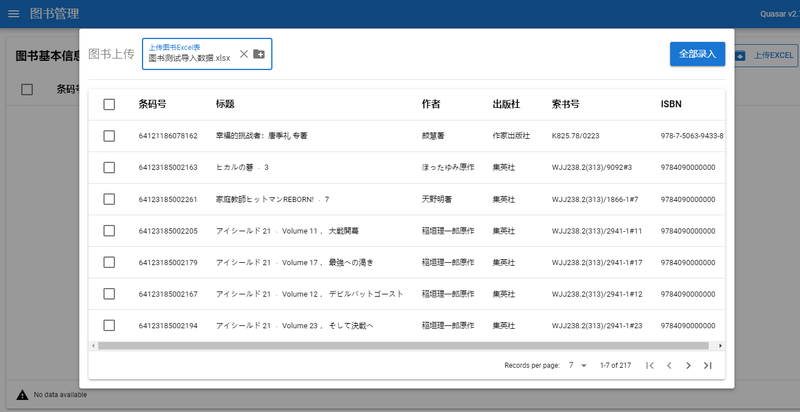
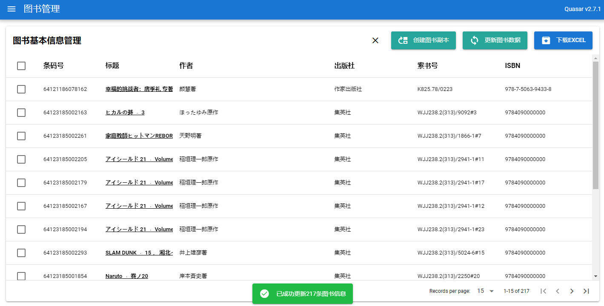
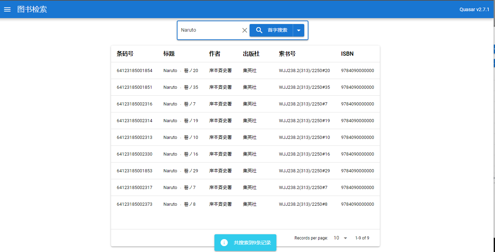

# library-demo-quarkus Project

- Java版本： OpenJDK 17

- 框架版本：Quarkus 2.9.2

- maven版本：3.8.4

  - 实测使用腾讯云maven可正常使用

- 默认端口：8080

- 启动命令：

  ```bash
  mvn compile quarkus:dev
  ```

- 数据库：dev模式下，使用h2数据库

- swagger地址：http://localhost:8080/q/swagger-ui

- 前端：使用quasar v2（Vue3）开发

- 默认管理员：

  - 用户名：admin
  - 密码：admin


## 关于数据导入

在进入界面后，可以使用左侧工具栏进入“图书管理”页面


接下来，点击右上角的上传Excel可以导入Excel中的图书数据



导入后，点击更新图书数据，这些数据就会存入数据库



回到搜索页，就可以正常搜索了




以下是框架生成时自带的说明文件

This project uses Quarkus, the Supersonic Subatomic Java Framework.

If you want to learn more about Quarkus, please visit its website: https://quarkus.io/ .

## Running the application in dev mode

You can run your application in dev mode that enables live coding using:
```shell script
./mvnw compile quarkus:dev
```

> **_NOTE:_**  Quarkus now ships with a Dev UI, which is available in dev mode only at http://localhost:8080/q/dev/.

## Packaging and running the application

The application can be packaged using:
```shell script
./mvnw package
```
It produces the `quarkus-run.jar` file in the `target/quarkus-app/` directory.
Be aware that it’s not an _über-jar_ as the dependencies are copied into the `target/quarkus-app/lib/` directory.

The application is now runnable using `java -jar target/quarkus-app/quarkus-run.jar`.

If you want to build an _über-jar_, execute the following command:
```shell script
./mvnw package -Dquarkus.package.type=uber-jar
```

The application, packaged as an _über-jar_, is now runnable using `java -jar target/*-runner.jar`.

## Creating a native executable

You can create a native executable using: 
```shell script
./mvnw package -Pnative
```

Or, if you don't have GraalVM installed, you can run the native executable build in a container using: 
```shell script
./mvnw package -Pnative -Dquarkus.native.container-build=true
```

You can then execute your native executable with: `./target/library-demo-quarkus-1.0.0-SNAPSHOT-runner`

If you want to learn more about building native executables, please consult https://quarkus.io/guides/maven-tooling.

## Provided Code

### RESTEasy Reactive

Easily start your Reactive RESTful Web Services

[Related guide section...](https://quarkus.io/guides/getting-started-reactive#reactive-jax-rs-resources)
